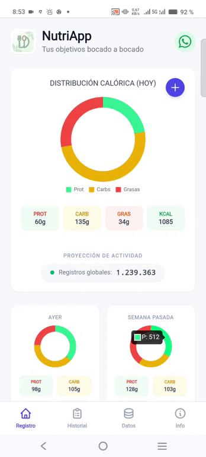

  
  <h1>NutriApp</h1>
  

    <strong>Diario Nutricional y Calculadora de Macros</strong>
  

  

    Aplicación Web Progresiva (PWA) para el registro, control y análisis de la ingesta diaria, centrada en la privacidad y el funcionamiento offline.
  

---
# NutriApp - Diario Nutricional y Calculadora de Macros

**NutriApp** es una Aplicación Web Progresiva (PWA) diseñada para el registro, control y análisis de la ingesta diaria de alimentos. Su arquitectura se centra en la privacidad del usuario, ejecutándose íntegramente en el navegador y almacenando los datos de manera local sin dependencia de servidores externos.

## Características Principales

* **Registro Diario (Alimentos y Recetas):** Interfaz unificada para registrar alimentos individuales (gramos/unidades) o recetas completas (unidades).
* **Gestión de Recetas:**
  * **Creación:** Permite crear recetas personalizadas agrupando alimentos desde el historial.
  * **Uso:** Las recetas guardadas calculan automáticamente la suma de macros y calorías.
  * **Desglose:** Al analizar una receta en el historial, se pueden visualizar sus ingredientes originales.
* **Base de Datos Híbrida:**
  * Listado predefinido de alimentos comunes.
  * **Búsqueda Online:** Integración con la API de *OpenFoodFacts* para localizar productos comerciales.
  * **Escáner de Códigos de Barras:** Utilidad integrada para escanear productos físicos mediante la cámara.
* **Comunidad (Simulación):** Contador de "Proyección de Registros" que estima la actividad global de la app para motivar al usuario.
* **Compartir:** Botón integrado para compartir la aplicación rápidamente vía WhatsApp.
* **Visualización de Datos:** Gráficos de distribución calórica (proteínas, carbohidratos, grasas) y resumen numérico en tiempo real.
* **Historial y Filtrado:** Consulta de registros pasados con filtros por rango de fechas.
* **Análisis Personalizado:** Herramienta de selección múltiple para analizar la suma nutricional de registros específicos.
* **Gestión de Datos (Backup Completo):** Sistema de exportación e importación que incluye historial, alimentos personalizados y recetas.

## Guía de Uso

### 1. Panel de Registro (Inicio)

Esta vista actúa como el cuadro de mando principal de la aplicación, diseñado para ofrecer una visión rápida del estado nutricional actual y facilitar la introducción de nuevos datos.

* **Resumen Nutricional (Dashboard):**
* **Gráfico de Distribución:** Un gráfico de anillo central muestra la proporción de macronutrientes consumidos en el día (Proteínas, Carbohidratos, Grasas).
* **Indicadores Numéricos:** Debajo del gráfico, se detallan los gramos totales consumidos por macronutriente y el total calórico acumulado (Kcal).
* **Compartir App:** En la cabecera, un botón permite compartir el enlace de la aplicación directamente vía WhatsApp.

* **Tarjetas de Tendencia (Comparativas):**
* Justo debajo del panel principal, se encuentran dos tarjetas de resumen que muestran el progreso nutricional de **"Ayer"** y de la **"Semana Pasada"**. Esto permite comparar visualmente la ingesta actual con periodos anteriores sin necesidad de navegar al historial.

* **Botón de Acción (+):**
* Situado en la esquina superior de la tarjeta principal, despliega un menú modal para elegir qué tipo de entrada se desea registrar: **Alimento** o **Receta**.

* **Modal de Registro de Alimentos:**
* **Buscador y Escáner:** Permite buscar productos en la base de datos de *OpenFoodFacts* o utilizar la cámara del dispositivo para escanear códigos de barras. Los resultados se añaden a la lista local.
* **Selector de Alimentos:** Un desplegable con la base de datos local de alimentos. Junto al selector, existen opciones para **compartir** el alimento seleccionado (vía WhatsApp) o **eliminarlo** permanentemente de la lista.
* **Entrada de Datos:** Se especifica la fecha y la cantidad (gramos o unidades) antes de añadir al diario.

* **Modal de Registro de Recetas:**
* Permite seleccionar una receta previamente creada. Al igual que con los alimentos, incluye opciones para compartir la receta o eliminarla de la base de datos.
* Calcula automáticamente los macros totales según las raciones indicadas.

* **Proyección de Comunidad:** Un contador en la parte inferior simula la actividad global de registros en la plataforma.

### 2. Historial y Análisis

Sección dedicada a la revisión detallada de los registros, la edición de datos y la creación de nuevas recetas a partir de comidas existentes.

* **Navegación y Filtrado:**
* **Filtro por Fechas:** Selectores de fecha "Desde" y "Hasta" para acotar la lista de registros.
* **Navegación Rápida:** Botones de acceso directo para moverse ágilmente entre días: **"-1 Día"**, **"Hoy"** y **"+1 Día"**.

* **Tabla de Registros:**
* Muestra un listado detallado con el nombre del alimento/receta, la cantidad, las calorías y la fecha.
* Permite eliminar entradas individuales pulsando el icono de papelera.
* **Selección Múltiple:** Mediante las casillas de verificación (checkboxes) a la izquierda de cada fila, se pueden seleccionar varios elementos simultáneamente para su procesamiento.

* **Modo Análisis y Creación de Recetas:**
  1.  **Selección:** Marque las casillas de los alimentos que componen una comida o que desea agrupar (por ejemplo, todos los ingredientes de un almuerzo).
  2.  **Botón Analizar:** Al seleccionar uno o más elementos, aparecerá un botón flotante **"Analizar"** en la esquina inferior derecha.
  3.  **Detalle Nutricional:** Se abrirá una ventana con la suma total de macros y calorías de la selección, junto con un gráfico de distribución específico para esos ítems.
  4.  **Guardar como Receta:** Dentro de esta ventana de análisis, el botón con el icono de **"+"** permite convertir la selección actual en una nueva **Receta**.
  5.  **Confirmación:** Asigne un nombre y una descripción para guardarla en su base de datos personal y reutilizarla en el futuro.

  

### 3. Gestión de Datos

Ubicado en la pestaña "Datos", permite la persistencia total:

* **Exportar todo:** Genera un archivo `.json` que contiene: Historial + Alimentos Personalizados + Recetas Creadas, este archivo se descarga en su dispositivo, conservelo para su uso en caso de borrado accidental.
* **Importar copia:** Restaura todos los datos desde un archivo previo.
* **Borrar todo:** Factory Reset (elimina historial, alimentos y recetas del navegador).

### 4. Instalación y Requisitos Técnicos

Esta aplicación es una **PWA (Progressive Web App)** estática.

* **Requisitos:** Cualquier navegador web moderno con soporte para JavaScript y LocalStorage (Chrome, Safari, Firefox, Edge).
* **Instalación:** Puede añadir la aplicación a la pantalla de inicio de su dispositivo móvil para utilizarla como una aplicación nativa y acceder a ella sin conexión.
* **Tecnologías:** HTML5, Tailwind CSS, Chart.js, Html5Qrcode.
* **Enlace a la App:** [https://diegomguillen.github.io/registro_nutricional](https://diegomguillen.github.io/registro_nutricional)
### 5. Licencia y Atribución de Datos (Open Food Facts)

Esta aplicación utiliza datos, productos e información nutricional procedentes de **Open Food Facts**.

* **Fuente de Datos:** [Open Food Facts](https://es.openfoodfacts.org) - La base de datos de productos alimenticios libre y abierta.
* **Licencia de la Base de Datos:** Los datos están disponibles bajo la [Open Database License (ODbL)](https://opendatacommons.org/licenses/odbl/1-0/).
* **Licencia de Contenidos:** Cualquier contenido individual (como imágenes) está disponible bajo la [Database Contents License (DbCL)](https://opendatacommons.org/licenses/dbcl/1-0/).
* **Colaboradores:** Agradecimiento a los miles de contribuyentes que mantienen y actualizan la base de datos de Open Food Facts diariamente.

El uso de estos datos no implica el respaldo de Open Food Facts al proyecto NutriApp.
### 6 .Disclaimer (Descargo de Responsabilidad)

**1. Propósito Informativo**
Esta aplicación ha sido desarrollada con fines exclusivamente educativos y de autogestión. La información proporcionada no constituye consejo profesional alguno, si tiene dudas, o no le interesa, no la use.

**2. Exactitud de los Datos**
* Los valores nutricionales predeterminados son aproximaciones.
* Los datos de búsqueda online provienen de *OpenFoodFacts*. Se recomienda verificar con el etiquetado físico.
* El contador de "Proyección de Registros" es un valor algorítmico estimado, no un dato en tiempo real de servidor, es así para garantizar la privacidad al máximo nivel.

**3. Privacidad**
NutriApp funciona del lado del cliente (*client-side*). Todos los datos (incluyendo recetas e historial) se almacenan exclusivamente en su dispositivo, solo los usa la app, nadie externo puede acceder a ellos, esta aplicación
no almacena datos en servidores externos, es. No se envían datos servidores externos, más allá de los puramente necesarios para que el servidor que aloja la web sepa que tiene que servírsela a su navegador, o el nombre o código de
barras del alimento a buscar, de hecho, podrá comprobar que en modo avión funcionará, salvo "Buscar Online", o si intenta recargar la web o aplicación.
Para borrar **todos** los rastros de Nutriapp simplemente pulse borrar todo desde la pestaña de "Gestión de datos" y elimine de la carpeta de descargas el archivo de copia de seguridad, y desinstalarla (si se la ha instalado).
